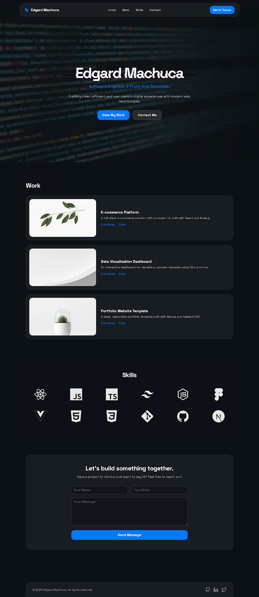

# Portafolio - Edgard Machuca

Este es mi portafolio personal, diseñado para mostrar mis proyectos, habilidades y experiencia como desarrollador. Está construido con tecnologías web modernas, enfocándose en un diseño limpio, responsivo y una experiencia de usuario fluida.



## 🚀 Características

-   **Integración con GitHub API**: Carga dinámicamente mis repositorios destacados y sus lenguajes directamente desde GitHub.
-   **Diseño Responsivo**: Adaptado para funcionar perfectamente en móviles, tablets y escritorio.
-   **Modo Oscuro**: Estética moderna con un tema oscuro ("Dark Mode") por defecto.
-   **Efectos Visuales**:
    -   Fondo con efecto Parallax.
    -   Barra de navegación con efecto "Glassmorphism" que aparece al hacer scroll.
    -   Animaciones suaves en hover y transiciones.
-   **Optimización**: Sistema de caché local para minimizar las peticiones a la API de GitHub y mejorar la velocidad de carga.

## 🛠 Tecnologías Utilizadas

-   **HTML5**: Estructura semántica.
-   **Tailwind CSS**: Framework de utilidad para el diseño y estilos (cargado vía CDN para desarrollo rápido).
-   **JavaScript (Vanilla)**: Lógica para la integración con la API, manejo del DOM y efectos de interfaz.
-   **Devicon**: Iconos de tecnologías.
-   **Google Fonts**: Tipografía 'Space Grotesk'.

## 📂 Estructura del Proyecto

```
.
├── code.html           # Archivo principal HTML
├── styles.css          # Estilos personalizados adicionales
├── script.js           # Lógica JS (API GitHub, UI interactions)
├── tailwind-config.js  # Configuración de Tailwind
└── img/                # Recursos de imagen
```

## 🔧 Instalación y Uso

1.  **Clonar el repositorio**:
    ```bash
    git clone https://github.com/Edgaarrdd/Portafolio.git
    ```
2.  **Abrir el proyecto**:
    Simplemente abre el archivo `code.html` en tu navegador web favorito. No se requiere un servidor backend ni procesos de compilación complejos, aunque se recomienda usar una extensión como "Live Server" en VS Code para una mejor experiencia de desarrollo.

## 📝 Personalización

Si deseas usar este portafolio como plantilla:

1.  Edita `script.js` y cambia la constante `GITHUB_USERNAME` por tu usuario de GitHub.
2.  Actualiza la lista `FEATURED_REPOS` en `script.js` con los nombres de tus repositorios que quieras destacar.
3.  Modifica la información personal en `code.html` (secciones "Sobre mí", "Contacto", etc.).

## 📄 Licencia

Este proyecto está bajo la Licencia MIT. Siéntete libre de usarlo y modificarlo.

---
Desarrollado por [Edgard Machuca](https://github.com/Edgaarrdd)
